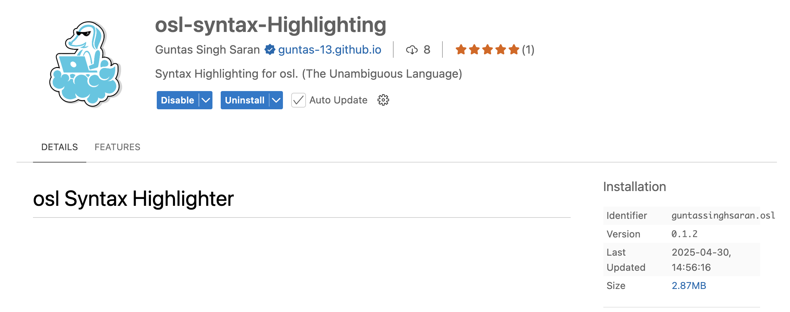

# Getting Started

Welcome to osl. This guide will help you set up the environment and explore the key features of osl.

## VSCode Extension: osl. Syntax Highlighting

Before you go ahead, enhance your coding experience with the `osl-syntax-highlighting` VSCode extension:

1. Open VSCode.
2. Go to Extensions (`Ctrl+Shift+X`).
3. Search for `osl-syntax-highlighting` and install.
4. Open `.osl` files to enjoy syntax highlighting and basic autocompletion.

Download it from the [VSCode Marketplace](https://marketplace.visualstudio.com/items?itemName=GuntasSinghSaran.osl).



## Quick Installation (C++ version)

The osl. compiler (cosl.) is under development written in C++ (current version supports typechecking). For now, use the following instructions:

1. Clone the repository:
   ```bash
   git clone https://github.com/mshandilya/osl.git
   cd osl.
   ```
2. Build the compiler (in progress):
   ```bash
   make
   ./bin/cosl <file.osl>
   ```

## Quick Installation (Python legacy version)

For the complete dummy osl. compiler (in Python) including bytecode and VM (in C++), use:

## Requirements

- Python 3.10+
- GCC compiler

1. Clone the repository:
   ```bash
   git clone https://github.com/mshandilya/osl.git
   cd osl./legacy/osl
   ```
2. Install dependencies:
   ```bash
   pip install -r requirements.txt
   ```
3. Build the C VM:
   ```bash
   gcc rosl.c -o rosl
   ```

### Run the interpreter

```bash
python3 run.py -i <codeFile.osl>
```

or

```bash
python3 run.py --run <codeFile.osl>
```

### Compile to bytecode

```bash
python3 run.py -c <codeFile.osl>
```

or

```bash
python3 run.py --compile <codeFile.osl>
```

### Execute bytecode with C VM

```bash
./rosl bytecode.bin
```

### Additional flags

`-t` or `--time`: Display execution/compilation time

```bash
python3 run.py -i -t <codeFile.osl>
```

### Generate coverage report

```bash
coverage run --include="src/codegen.py,src/visualizer.py,src/osl_lexer.py,src/osl_parser.py" run.py <codeFile.osl> -c
coverage html
```

## Writing a simple program

Here's a simple program in osl:

```py
log 1 + 3;
```

To run this:

1. Save it as `code.osl`.
2. Use the osl compiler (python version) to compile and execute:
   ```bash
   gcc rosl.c -o rosl
   python3 run.py -c code.osl
   ./rosl bytecode.bin
   ```

Expected output:

```
4
```

## Overview of Features

OSL is designed to be a modern, efficient scripting language. Here’s a quick look at its features (some implemented, others proposed):

- **Unambiguity**: Grammar designed to eliminate parsing ambiguities (see [Grammar](../documentation/grammar.md)).
- **Garbage Collection**: Automatic memory management via a mark-and-sweep GC in the Stack VM (see [GC](../dev/gc.md)).
- **Escape Analysis**: Planned optimization to reduce heap allocations.
- **Bytecode-Generated Stack VM**: Executes programs via an efficient stack-based virtual machine (see [Bytecode](../dev/bytecodeLeg.md)).
- **Strongly Typed**: Enforces type safety with explicit declarations (e.g., `i32`, `bool`).

Let’s dive deeper in the [User Documentation](../documentation/variables.md)!
